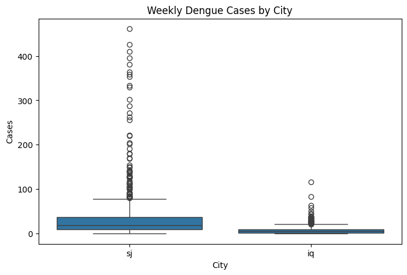
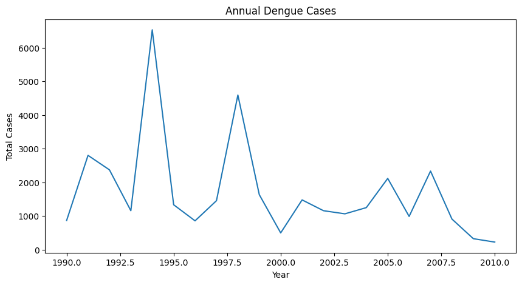
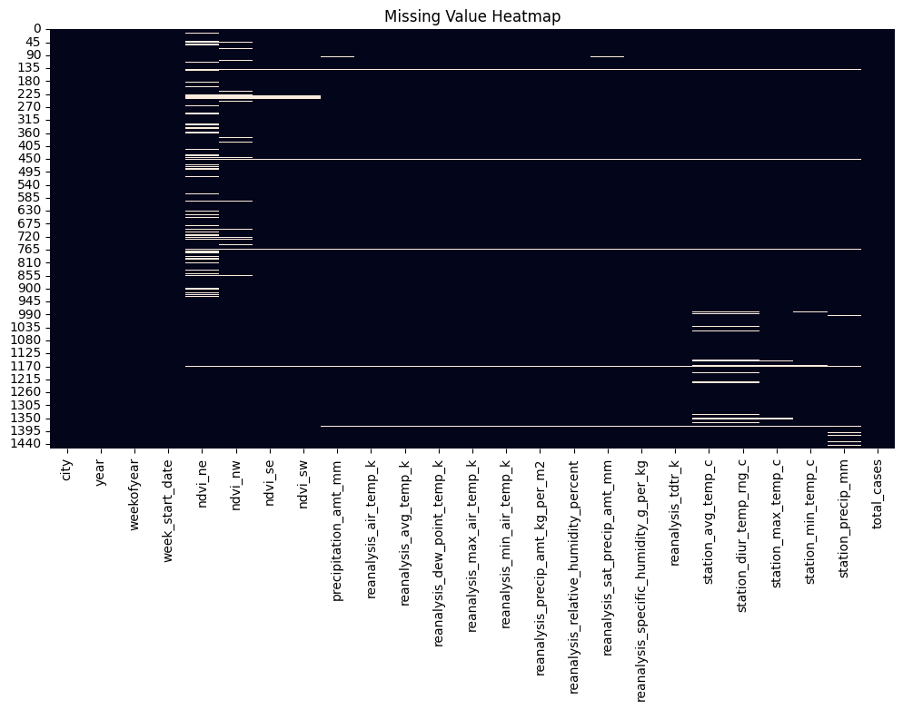
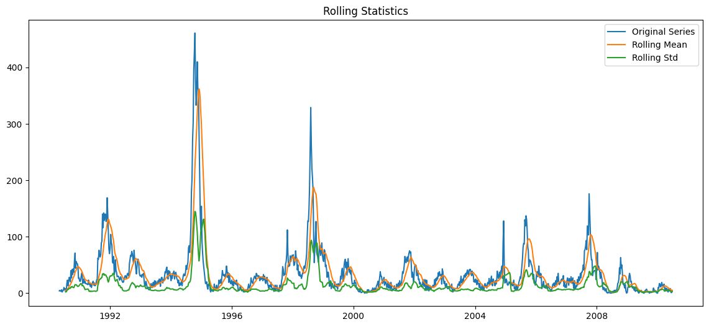
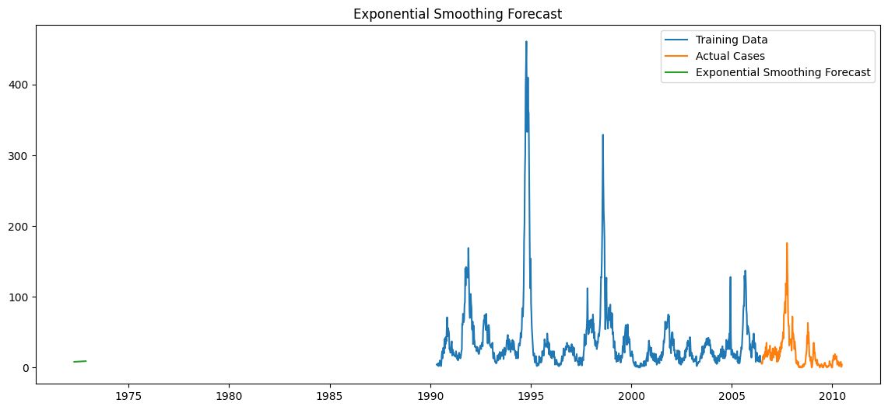
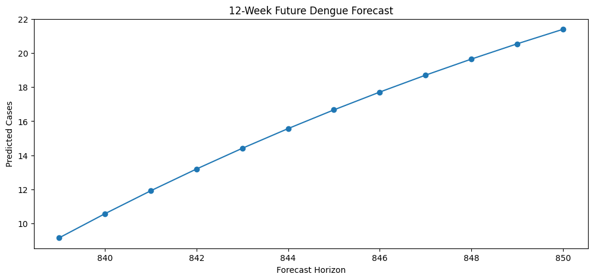
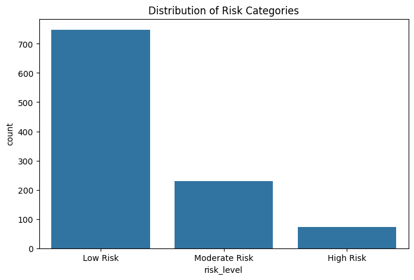
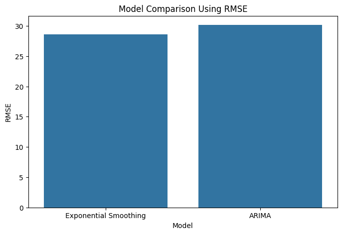
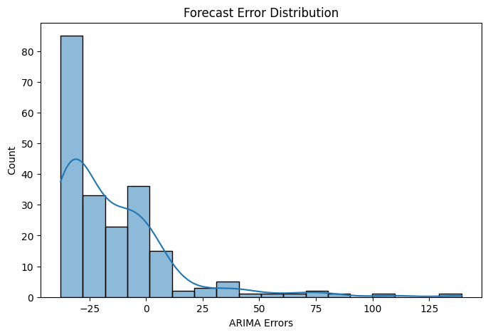

# Disease Outbreak Early Warning System

## Overview

The Disease Outbreak Early Warning System is a statistical surveillance and forecasting framework designed to monitor historical dengue fever incidence, identify outbreak periods, and generate early warning signals for public health decision-making.

The project integrates epidemiological surveillance data with environmental variables and applies time series analysis, forecasting models, outbreak detection algorithms, and risk classification techniques to transform historical disease records into actionable intelligence.

By combining forecasting and outbreak detection within a unified analytical workflow, the system demonstrates how statistical modeling can support disease surveillance, preparedness, and intervention planning.

---

# Project Objectives

The primary objectives of this project are to:

* Analyze historical dengue incidence trends.
* Explore temporal and seasonal disease patterns.
* Assess data quality and missing observations.
* Evaluate statistical forecasting models.
* Detect periods of elevated disease activity.
* Generate operational outbreak alerts.
* Support evidence-based public health decision-making.

---

# Research Question

Can statistical forecasting and outbreak detection methods be applied to historical dengue surveillance data to support disease early warning systems?

---

# Dataset

The project uses historical dengue surveillance data consisting of weekly disease incidence observations and environmental measurements associated with disease transmission dynamics.

## Dataset Summary

| Metric                               | Value              |
| ------------------------------------ | ------------------ |
| Raw Records                          | 1,456              |
| Aggregated Weekly Time Series Points | 1,049              |
| Time Period                          | 1990–2010          |
| Frequency                            | Weekly             |
| Target Variable                      | Total Dengue Cases |
| Missing Data Treatment               | Median Imputation  |

---

# Technology Stack

* Python
* Pandas
* NumPy
* Matplotlib
* Seaborn
* Statsmodels
* Scikit-Learn
* Jupyter Notebook

---

# Methodology

The project follows a structured disease surveillance workflow:

1. Data Collection and Integration
2. Exploratory Data Analysis
3. Missing Value Assessment
4. Median-Based Imputation
5. Stationarity Testing (ADF Test)
6. Exponential Smoothing Forecasting
7. ARIMA Forecasting
8. Forecast Evaluation
9. Outbreak Detection
10. Risk Classification
11. Early Warning Alert Generation

---

# Visualizations

## Distribution of Weekly Dengue Cases

Most weeks experienced relatively low dengue incidence, while a smaller number of weeks exhibited substantially higher disease activity, producing a right-skewed distribution characteristic of outbreak-driven diseases.

---

## Dengue Cases by City

Weekly dengue incidence differed across surveillance locations, highlighting geographic variation in disease transmission patterns.

---

## Annual Dengue Trend

Annual aggregation reveals substantial variation in dengue burden over time and identifies years characterized by elevated disease activity.

---

## Seasonal Disease Pattern

Average weekly dengue incidence demonstrates recurring seasonal fluctuations, suggesting the presence of temporal transmission patterns.

---

## Missing Value Assessment

Several environmental variables contained missing observations, particularly vegetation indices and selected weather-related measurements.

---

## Rolling Statistics

Rolling mean and rolling standard deviation were used to visually assess temporal stability before formal stationarity testing.

---

## Exponential Smoothing Forecast

Exponential Smoothing generated forecasts by assigning greater weight to more recent observations.

---

## ARIMA Forecast

The ARIMA(1,0,1) model captured temporal dependencies and generated forecasts based on historical disease incidence patterns.

---

## Forecast Comparison

Forecasts from Exponential Smoothing and ARIMA were compared against observed dengue incidence during the testing period.

---

## Future Dengue Forecast

The twelve-week ARIMA forecast projected a gradual increase in weekly dengue incidence over the forecast horizon.

---

## Historical Outbreak Detection

Weekly dengue incidence was evaluated relative to a statistical outbreak threshold to identify periods of elevated disease activity.

---

## Risk Category Distribution

Disease activity was classified into Low Risk, Moderate Risk, and High Risk categories to support operational surveillance.

---

## Model Comparison

Forecasting performance was evaluated primarily using RMSE to identify the most accurate forecasting model.

---

## Forecast Error Distribution

The distribution of ARIMA forecast residuals provides insight into model prediction behavior during the validation period.

---

# Project Workflow

## 1. Data Collection and Integration

* Loaded dengue surveillance features.
* Loaded dengue case counts.
* Merged datasets using city, year, and epidemiological week.
* Assessed dataset quality and completeness.

## 2. Exploratory Data Analysis

* Distribution analysis
* Geographic comparisons
* Annual trend analysis
* Seasonal pattern investigation

## 3. Missing Data Treatment

Environmental variables containing missing observations were imputed using median-based imputation.

## 4. Stationarity Testing

The Augmented Dickey-Fuller (ADF) test was used to evaluate stationarity.

### Results

| Metric        | Value       |
| ------------- | ----------- |
| ADF Statistic | -5.94       |
| P-Value       | 2.28 × 10⁻⁷ |

The null hypothesis of a unit root was rejected, indicating statistical stationarity.

---

## 5. Forecasting Models

Two forecasting approaches were evaluated.

### Exponential Smoothing

A trend-based forecasting model emphasizing recent observations.

### ARIMA(1,0,1)

A statistical model incorporating autoregressive and moving-average components.

---

## 6. Model Evaluation

### Forecast Accuracy

| Model                 | MAE   | RMSE  |
| --------------------- | ----- | ----- |
| Exponential Smoothing | 16.12 | 28.57 |
| ARIMA                 | 24.32 | 30.16 |

### Note on MAPE

Although Mean Absolute Percentage Error (MAPE) was calculated during model evaluation, zero-valued observations in the testing dataset resulted in undefined MAPE values (NaN). Consequently, RMSE served as the primary metric for model comparison.

### Best Model

Exponential Smoothing achieved the lowest RMSE and was selected as the preferred forecasting model.

---

## 7. Future Disease Forecast

A twelve-week ARIMA forecast was generated to assess future disease activity.

| Week | Predicted Cases |
| ---- | --------------- |
| 1    | 9.16            |
| 2    | 10.58           |
| 3    | 11.92           |
| 4    | 13.20           |
| 5    | 14.41           |
| 6    | 15.57           |
| 7    | 16.67           |
| 8    | 17.71           |
| 9    | 18.70           |
| 10   | 19.64           |
| 11   | 20.54           |
| 12   | 21.39           |

The forecast suggests a gradual increase in weekly dengue incidence throughout the forecast horizon.

---

## 8. Outbreak Detection Framework

### Threshold Definition

Outbreak Threshold = Mean Cases + Standard Deviation

### Results

| Metric             | Value |
| ------------------ | ----- |
| Mean Weekly Cases  | 34.25 |
| Standard Deviation | 48.87 |
| Outbreak Threshold | 83.12 |

Weeks exceeding the threshold were classified as outbreak periods.

---

## 9. Risk Classification

| Risk Level    | Count |
| ------------- | ----- |
| Low Risk      | 748   |
| Moderate Risk | 229   |
| High Risk     | 72    |

### Alert Summary

| Metric              | Value |
| ------------------- | ----- |
| Weekly Observations | 1,049 |
| High-Risk Alerts    | 72    |
| High-Risk Periods   | 6.86% |

---

# Key Findings

* Historical dengue incidence exhibited substantial variability and seasonal patterns.
* Several environmental variables contained missing observations that were successfully addressed through median imputation.
* The dengue incidence series satisfied the ADF stationarity criterion.
* Exponential Smoothing achieved the best forecasting performance.
* Exponential Smoothing obtained the lowest RMSE (28.57).
* The outbreak detection framework identified 72 High-Risk periods.
* Approximately 6.86% of surveillance weeks generated outbreak alerts.
* Future forecasts indicated increasing dengue activity.

---

# Public Health Significance

This project demonstrates how statistical forecasting and outbreak detection techniques can be integrated into a practical surveillance framework capable of:

* Monitoring disease activity
* Forecasting future incidence
* Detecting outbreak conditions
* Supporting preparedness planning
* Improving public health decision-making

---

# Future Improvements

Potential extensions include:

* SARIMA forecasting models
* Prophet forecasting
* Machine learning forecasting approaches
* Climate-variable integration
* Probabilistic forecasting
* Bayesian disease forecasting
* Real-time surveillance dashboards
* Geographic outbreak mapping
* Automated alert notification systems

---

# References

1. Box, G. E. P., Jenkins, G. M., Reinsel, G. C., & Ljung, G. M. *Time Series Analysis: Forecasting and Control*.
2. Hyndman, R. J., & Athanasopoulos, G. *Forecasting: Principles and Practice*.
3. World Health Organization. *Dengue and Severe Dengue*.
4. Centers for Disease Control and Prevention. *Dengue Surveillance and Epidemiology*.
5. [Statsmodels](https://www.statsmodels.org?utm_source=chatgpt.com) Documentation.
6. [Scikit-Learn](https://scikit-learn.org?utm_source=chatgpt.com) Documentation.
7. [Pandas](https://pandas.pydata.org?utm_source=chatgpt.com) Documentation.
8. [NumPy](https://numpy.org?utm_source=chatgpt.com) Documentation.

