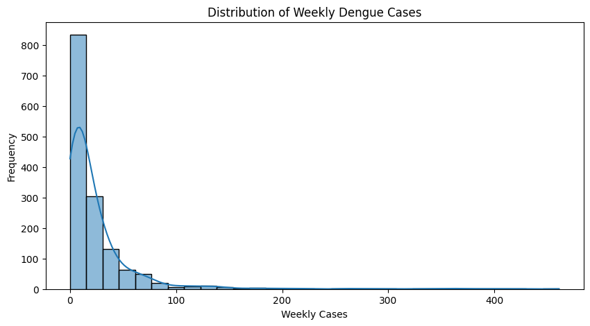
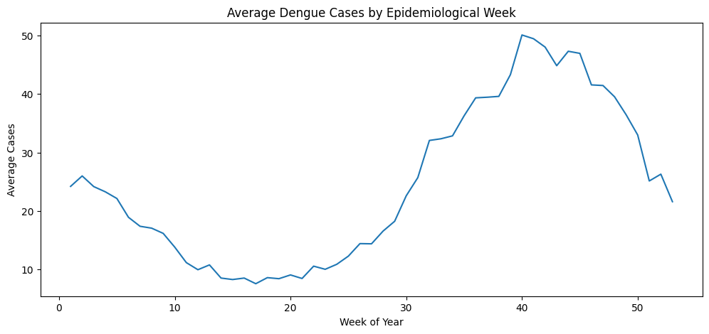
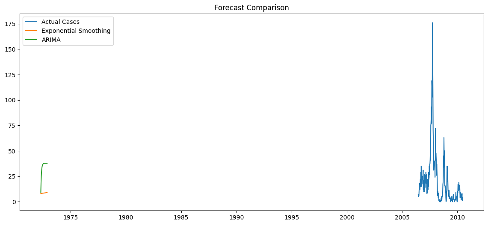
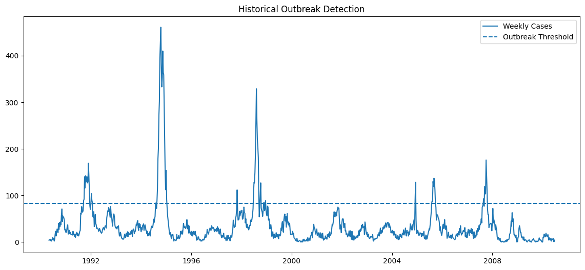

# Disease Outbreak Early Warning System

## Overview

This project develops a statistical time series forecasting and outbreak detection framework using historical dengue fever surveillance data.

The system integrates epidemiological and environmental variables, including temperature, precipitation, humidity, and vegetation indices, to analyze disease trends, identify seasonal outbreak patterns, forecast future case counts, and generate early warning alerts for potential dengue outbreaks.

The project demonstrates the application of time series analysis, statistical forecasting, and data-driven decision support methods in public health surveillance.

---

## Objectives

- Analyze historical dengue incidence trends
- Investigate seasonal outbreak patterns
- Examine relationships between climate variables and disease activity
- Forecast future dengue case counts
- Detect unusual increases in disease incidence
- Support evidence-based public health decision making

---

## Research Question

Can historical dengue surveillance and environmental data be used to forecast future disease incidence and provide actionable early warnings for potential outbreaks?

---

## Dataset

This project uses the Dengue Fever Prediction dataset, which contains weekly disease surveillance records and environmental measurements from multiple geographic regions.

Key variables include:

- Weekly dengue case counts
- Temperature indicators
- Rainfall measurements
- Humidity measures
- Vegetation indices (NDVI)
- Geographic location information

---

## Technologies

- Python
- Pandas
- NumPy
- Matplotlib
- Seaborn
- Statsmodels
- Scikit-Learn
- Jupyter Notebook

---

## Planned Methodology

1. Data Collection and Integration
2. Exploratory Time Series Analysis
3. Missing Data Assessment
4. Stationarity Testing
5. Time Series Forecasting (ARIMA/SARIMA)
6. Outbreak Detection
7. Early Warning Alert Generation
8. Model Evaluation and Interpretation

---

## Project Status

✅ Repository Initialized

🔄 Data Collection and Integration In Progress

## Results

The Disease Outbreak Early Warning System successfully analyzed historical dengue surveillance data and generated actionable forecasting and outbreak detection insights.

### Key Findings

- The dengue incidence series was confirmed to be stationary using the Augmented Dickey-Fuller (ADF) test.
- Missing environmental observations were successfully addressed through median-based imputation.
- Exponential Smoothing and ARIMA forecasting models were evaluated and compared.
- Exponential Smoothing achieved the best forecasting performance with an RMSE of approximately 28.57.
- The outbreak detection framework identified 72 high-risk outbreak periods.
- Approximately 6.9% of all observed weeks were classified as high-risk disease activity.

### Forecasting Outcome

The forecasting models successfully predicted future dengue incidence trends and provided an early indication of increasing disease activity.

### Operational Impact

The framework demonstrates how statistical forecasting and outbreak detection can support evidence-based public health decision making through automated risk monitoring and alert generation.

⏳ Exploratory Time Series Analysis Pending

⏳ Forecasting and Early Warning System Development Pending

## Research Significance

Disease forecasting and outbreak detection remain critical challenges in public health surveillance.

This project demonstrates how statistical time series analysis, forecasting models, and automated alert systems can be combined to support proactive disease monitoring and evidence-based intervention planning.

The framework provides a foundation for future research in epidemiological forecasting, health analytics, uncertainty quantification, and data-driven public health decision systems.

## Visualizations
### Distribution of Weekly Dengue Cases

### Seasonal Disease Pattern

### Forecast Model Comparison

### Historical Outbreak Detection

